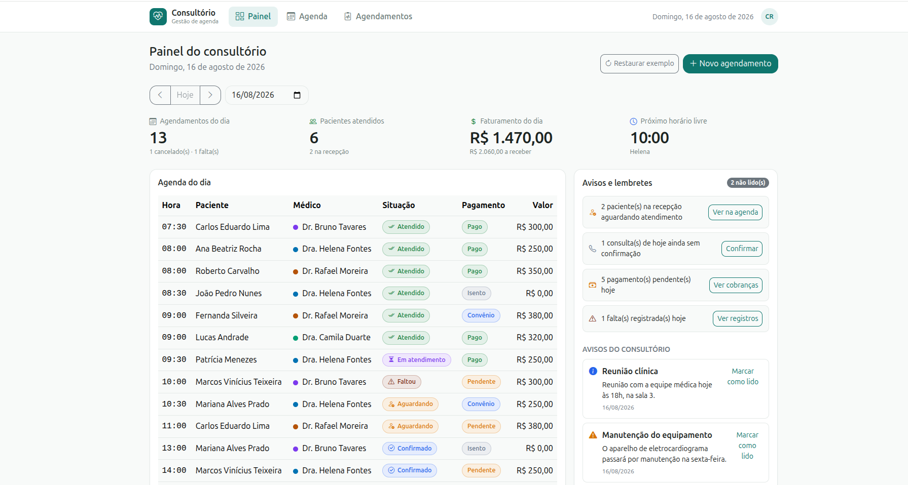
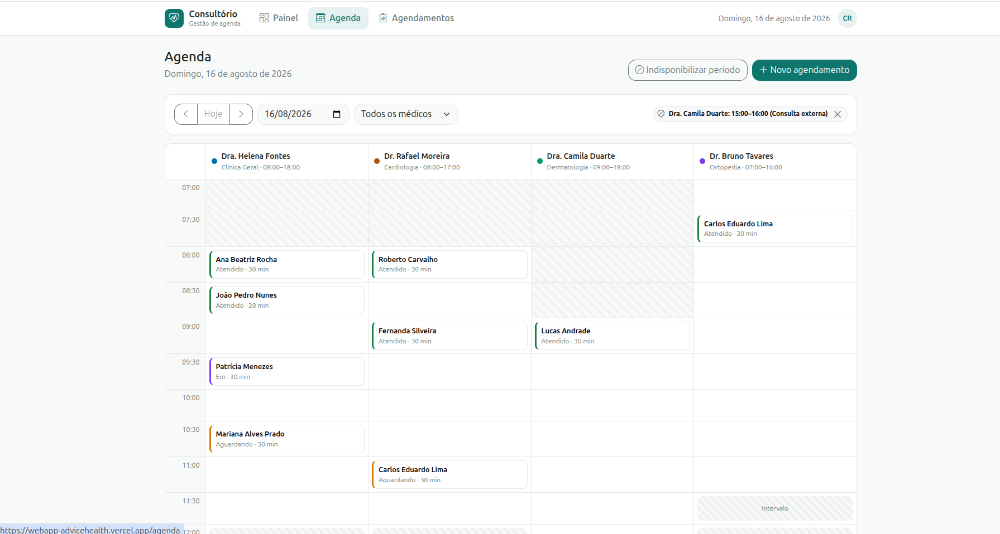

# Consultório — Gestão de Agenda


[](https://webapp-advicehealth.vercel.app/)

WebApp para a rotina administrativa de um consultório médico: a recepção agenda
e cobra, o gestor acompanha o dia.

**→ [Acessar a aplicação](https://webapp-advicehealth.vercel.app/)**

---

## Índice

- [Descrição do projeto](#descrição-do-projeto)
- [Status do projeto](#status-do-projeto)
- [Funcionalidades](#funcionalidades)
- [Demonstração](#demonstração)
- [Acesso ao projeto](#acesso-ao-projeto)
- [Tecnologias utilizadas](#tecnologias-utilizadas)
- [Estrutura do código](#estrutura-do-código)
- [Modelo de domínio](#modelo-de-domínio)
- [Decisões de arquitetura](#decisões-de-arquitetura)
- [Decisões de produto](#decisões-de-produto)
- [Acessibilidade](#acessibilidade)
- [Verificação do escopo](#verificação-do-escopo)
- [Publicação](#publicação)
- [Pessoas desenvolvedoras](#pessoas-desenvolvedoras)
- [Pessoas contribuidoras](#pessoas-contribuidoras)
- [Licença](#licença)

---

## Descrição do projeto

Consultórios pequenos administram o dia em três perguntas: **quem vem hoje**,
**quem já foi atendido** e **o que ainda não foi pago**. Este WebApp organiza
essas três respostas em três telas.

- **Painel do consultório** — indicadores do dia, agenda, avisos e lembretes
  calculados a partir do próprio movimento.
- **Agenda** — grade de horários por médico, com inclusão, alteração,
  cancelamento, transferência e indisponibilização de períodos.
- **Consulta de agendamentos** — pacientes agendados e atendidos, com os dados
  do paciente, do atendimento, do médico e da cobrança.

Não há backend: os dados ficam no `localStorage` do navegador, atrás de uma
camada de serviço que simula a latência de uma API.

---

## Status do projeto

**Concluído.** Os três módulos estão implementados e o escopo foi conferido
linha a linha, com doze lacunas encontradas e corrigidas (ver
[Verificação do escopo](#verificação-do-escopo)).

---

## Funcionalidades

| | Funcionalidade |
|---|---|
| ✅ | Indicadores do dia: agendamentos, atendidos, faturamento e próximo horário livre |
| ✅ | Agenda do dia e navegação entre datas, no painel e na agenda |
| ✅ | Avisos cadastrados e lembretes derivados, cada um levando à tela que resolve |
| ✅ | Grade de horários com uma coluna por médico e filtro por profissional |
| ✅ | Incluir agendamento pelo botão ou clicando num horário livre |
| ✅ | Alterar, cancelar e transferir agendamento, com histórico do que mudou |
| ✅ | Indisponibilizar períodos, inclusive de vários dias, recusando quando há conflitos |
| ✅ | Cadastro do paciente no ato, com busca por CPF para não duplicar ficha |
| ✅ | Cobrança no momento do agendamento, com forma de pagamento |
| ✅ | Consulta por grupo, médico, situação, pagamento, período, nome ou CPF |
| ✅ | Edição do agendamento e da cobrança, com atalho para pagamentos pendentes |
| ✅ | Validação de campos obrigatórios, notificações e confirmação em ação sem volta |
| ✅ | Responsivo e navegável por teclado |

---

## Demonstração

<!--
  Para incluir capturas, salve os arquivos em docs/ e remova os comentários:

  ### Painel do consultório
  

  ### Agenda
  

  ### Agendamento
  

  ### Consulta de agendamentos
  
-->

Capturas de tela em breve. Enquanto isso, o projeto pode ser executado
localmente em um comando — ver a seção seguinte.

---

## Acesso ao projeto

**Aplicação publicada:** <https://webapp-advicehealth.vercel.app/>

**Repositório:** <https://github.com/thaissyudamian/webapp_advicehealth>

### Executando localmente

```bash
git clone https://github.com/thaissyudamian/webapp_advicehealth.git
cd webapp_advicehealth
npm install
npm run dev      # http://localhost:5173
```

Outros comandos:

```bash
npm run build    # gera a versão de produção em dist/
npm run preview  # serve o conteúdo de dist/ localmente
npm run lint     # ESLint
```

A aplicação carrega uma massa de exemplo na primeira execução — médicos,
pacientes e uma agenda montada em torno do dia corrente. O botão **Restaurar
exemplo**, no painel, devolve tudo ao estado inicial.

---

## Tecnologias utilizadas

| | |
|---|---|
| React 18 | componentes de função e hooks |
| Vite | build e servidor de desenvolvimento |
| Bootstrap 5.3 | CSS (grid, utilitários e componentes) |
| Bootstrap Icons | ícones |
| React Router | três rotas, com estado na URL |

Dependências de produção: `react`, `react-dom`, `react-router-dom`,
`bootstrap`, `bootstrap-icons`. Nenhuma biblioteca de componentes, de tabela,
de calendário, de máscara ou de datas — essas partes são justamente o que o
escopo pede que seja construído com HTML, CSS, Bootstrap e React.

---

## Estrutura do código

```
src/
├── domain/             regras, formatação e consultas — sem React
│   ├── constants.js    máquina de estados e listas fixas
│   ├── format.js       datas, moeda, CPF, telefone, CEP
│   ├── validators.js   validação de campo
│   └── selectors.js    consultas puras sobre o estado
├── data/seed.js        massa de exemplo, relativa ao dia corrente
├── services/           persistência (localStorage)
├── store/              estado global (Context + useReducer)
├── hooks/              useForm, contexto de notificações
├── components/
│   ├── ui/             genéricos, sem regra de negócio
│   ├── layout/         barra superior e estrutura
│   ├── agenda/         grade, formulário, transferência, bloqueio
│   └── *.jsx           componentes que conhecem o domínio
├── pages/              as três telas
└── styles/theme.css    tokens de design e ajustes do Bootstrap
```

**A regra que sustenta o reaproveitamento:** nenhum componente de
`components/ui/` importa de `store/`, `domain/` ou `data/`. É isso que permite
copiar `Modal`, `FormField`, `Badge`, `StatCard`, `EmptyState`,
`ConfirmDialog`, `PageHeader` e `ToastProvider` para outro projeto sem levar
junto o conceito de agendamento.

Componentes que precisam conhecer o domínio ficam um nível acima, em
`components/`.

---

## Modelo de domínio

```
Medico       { id, nome, especialidade, crm, cor, valorConsulta, horarioAtendimento }
Paciente     { id, nome, cpf, nascimento, sexo, telefone, email, convenio, endereco }
Agendamento  { id, pacienteId, medicoId, data, hora, duracao, tipo, status,
               observacoes, pagamento, historico[] }
Bloqueio     { id, medicoId, data, dataFim, horaInicio, horaFim, motivo }
Aviso        { id, titulo, texto, tipo, data, lido }
```

**A situação do agendamento é uma máquina de estados**, declarada em
`constants.js` junto com as transições permitidas:

```
agendado → confirmado → aguardando → em atendimento → atendido
                    ↘ cancelado / faltou
```

No bloqueio, `dataFim` é opcional: férias e congresso raramente cabem em um
dia, mas sem a data final o registro vale apenas no dia de início — o que
mantém válido o formato anterior.

A interface consulta `proximosStatus()` para saber o que oferecer. Um
agendamento cancelado não exibe "registrar chegada" porque a regra diz que essa
transição não existe.

Duas consequências práticas:

- "agendamentos do dia" e "pacientes atendidos" são o **mesmo dado em estados
  diferentes**, derivados por filtro da mesma lista. Não podem divergir.
- `STATUS_OCUPAM_HORARIO` declara que cancelado e falta **liberam a vaga** na
  grade, em um lugar só.

**O pagamento tem situação própria** (`pendente`, `pago`, `isento`,
`convenio`), independente da situação da consulta. Sem isso, "atendido mas não
pago" — o caso que o financeiro precisa ver — não seria representável, nem o
convênio, que fatura depois do atendimento.

---

## Decisões de arquitetura

### CSS do Bootstrap sim, JavaScript do Bootstrap não

O Bootstrap distribui dois artefatos independentes: o framework CSS e doze
scripts de comportamento. O CSS é usado integralmente, com as classes oficiais
no markup (`.modal`, `.modal-dialog`, `.modal-backdrop`, `.offcanvas`). Apenas
o `bootstrap.bundle.js` fica de fora.

O JavaScript do Bootstrap manipula o DOM diretamente — injeta nós no `<body>` e
altera `body.style` — enquanto o React assume ser o dono do DOM. Os dois juntos
produzem os defeitos conhecidos: modal que não fecha, backdrop preso na tela.
Aqui, quem controla abrir e fechar é o estado do React.

### Tema em três camadas

`styles/theme.css` tem tokens próprios (`--ah-*`), o remapeamento das variáveis
`--bs-*` e a reescrita das regras que trazem a cor primária fixa em
hexadecimal no CSS compilado — botões, campos em foco, abas, paginação. Sem
essa terceira camada, a interface ficaria com botões na cor da marca e
checkbox, aba ativa e anel de foco em azul.

Nenhum override usa `!important`: têm a mesma especificidade das regras
originais e vencem por ordem de declaração. Por isso o tema é importado
**depois** do Bootstrap em `main.jsx`.

### Datas como texto, nunca como `Date`

Datas circulam como `'AAAA-MM-DD'` e horários como `'HH:MM'`.
`new Date('2026-08-14')` é interpretado como meia-noite UTC e, no Brasil,
retorna 13 de agosto às 21h — um agendamento marcado para hoje apareceria
ontem. Onde um objeto `Date` é inevitável, ele é montado por
`new Date(ano, mes - 1, dia)`, que usa o fuso local.

### Estado global com `Context` + `useReducer`

Redux seria peso morto para três telas; estado local não sobrevive ao painel
precisar dos dados que a agenda produz. O reducer importa porque uma operação
mexe em mais de uma coleção — salvar um agendamento pode cadastrar o paciente
junto — e com estados separados haveria uma janela de inconsistência.

### Persistência atrás de uma camada de serviço

Toda leitura e escrita passa por `services/clinicaService.js`, com latência
simulada de 350–400 ms. Sem a espera, os estados de carregamento e os botões
"salvando…" nunca apareceriam em desenvolvimento, e a interface só quebraria ao
ser ligada a um servidor real. Como as funções já são assíncronas, trocar por
`fetch()` não muda nenhuma assinatura.

### A cobrança abre pronta para cobrar

O escopo parte de que "o pagamento da consulta ocorrerá nesse momento", e o
botão diz "confirmar agendamento e cobrar". O formulário abre com a situação
já em "pago", e paciente de convênio abre em "faturar no convênio" — a exceção
real, em que o consultório fatura depois do atendimento.

A edição da cobrança também é uma ação própria, alcançável em um clique a
partir do detalhe do agendamento ou da linha da consulta. As regras de
validação são as mesmas do formulário completo, importadas do domínio: não
existem duas definições do que é uma cobrança válida.

### Estado de tela na URL

Data da agenda, data do painel e filtros da consulta ficam em *query string*.
Isso preserva o contexto ao recarregar, permite compartilhar um link e faz o
botão voltar do navegador funcionar. É também o que permite um lembrete do
painel apontar para a consulta **já filtrada**.

Como consequência, `BrowserRouter` exige que o servidor devolva o `index.html`
em qualquer caminho — configurado em `vercel.json`.

---

## Decisões de produto

O enunciado menciona wireframes de referência, mas eles não acompanharam o
material recebido: todas as decisões abaixo foram derivadas do **texto do
escopo**. O wireframe usado como referência visual — navegação no topo,
horários em fichas, formas de pagamento como botões — foi desenhado por mim
durante o desenvolvimento, e não fornecido pelo teste.

1. **Busca por CPF antes do cadastro.** Coletar os dados do paciente do zero a
   cada agendamento produz fichas duplicadas — a falha mais comum desse tipo de
   sistema. O formulário começa pelo CPF: paciente existente traz os dados
   preenchidos, paciente novo abre o cadastro completo.

2. **Horários em fichas, não em lista suspensa.** A lista esconde a
   disponibilidade e o conflito só aparece ao salvar. Com as fichas, o horário
   ocupado fica esmaecido e não é clicável — a validação de conflito vira
   prevenção.

3. **Estado "aguardando" (check-in na recepção).** Sem ele não há como
   responder "quem já chegou?", que é a pergunta mais frequente do balcão.

4. **Cobrança desacoplada do atendimento**, para representar convênio e
   pendências.

5. **Histórico no agendamento.** Transferência, cancelamento e alteração de
   valor registram o que mudou e quando.

6. **Lembretes calculados no painel.** Além dos avisos cadastrados, o painel
   deriva pendências reais do movimento do dia — "5 pagamentos pendentes",
   "2 consultas sem confirmação" — e cada uma leva à tela já filtrada.

7. **Indicador "próximo horário livre"**, que responde a pergunta mais feita ao
   telefone sem precisar abrir a agenda.

8. **Bloqueio de período recusado quando há agendamentos na faixa**, com os
   conflitos listados — verificados em todos os dias do intervalo, não só no
   primeiro. Apagar a agenda de alguém por engano é pior do que exigir um passo
   a mais.

9. **A consulta fala em dois grupos, não em sete estados.** O escopo pede
   "pacientes agendados e atendidos"; expor os sete estados do modelo obrigaria
   quatro consultas separadas para responder "quantos agendados existem?". O
   filtro por situação continua disponível para quem precisa de precisão.

10. **Atalho de cobrança nas linhas pendentes.** Um atendimento acontece uma
    vez; a cobrança dele muda depois. O lembrete do painel leva à lista
    filtrada, e de lá um clique resolve — sem abrir o formulário completo.

---

## Acessibilidade

- HTML semântico: `main`, `nav`, `section`, `table` com `thead`/`tbody`,
  `form` com `onSubmit`, `label` associado a cada campo
- atalho "pular para o conteúdo" para navegação por teclado
- foco devolvido ao elemento de origem ao fechar um modal
- foco levado ao primeiro campo inválido quando o envio falha
- campos obrigatórios marcados com `aria-required`, e não apenas com o
  asterisco do rótulo, que vem de CSS e nem todo leitor de tela anuncia
- mensagem de erro do formulário com `role="alert"`, anunciada ao tentar enviar
- situação nunca comunicada só por cor — sempre com rótulo em texto; períodos
  indisponíveis também se distinguem por textura
- cores dos médicos verificadas para daltonismo (separação mínima ΔE 9,3 em
  deutan) e contraste de texto conforme WCAG AA

---

## Verificação do escopo

Depois dos três módulos prontos, cada frase do enunciado foi conferida contra a
tela, com a pergunta "onde exatamente isso aparece?". Doze lacunas apareceram e
foram corrigidas — nenhuma delas acusada por lint ou build, porque em todas o
dado existia, a lógica estava certa e faltava exibir. As correções estão nos
commits `ad1d332`, `9fe3a48`, `ff7d103`, `4138a96` e `3cac58e`.

## Publicação

O projeto gera um site estático:

```bash
npm run build
```

O `vercel.json` já contém o *rewrite* necessário para que rotas como `/agenda`
funcionem ao serem abertas diretamente.

Os dados vivem no navegador de cada visitante — cada pessoa que abrir o
endereço recebe a massa de exemplo e pode alterá-la sem afetar as demais.

---

## Pessoas desenvolvedoras

| | |
|---|---|
| **Thaíssy Damian** | [GitHub](https://github.com/thaissyudamian) · [LinkedIn](#) <!-- inserir URL --> |

---

## Pessoas contribuidoras

Projeto individual. Contribuições são bem-vindas: abra uma *issue* descrevendo
a proposta antes de enviar um *pull request*.

---

## Licença

Distribuído sob a licença MIT. Ver [`LICENSE`](LICENSE) para o texto completo.
