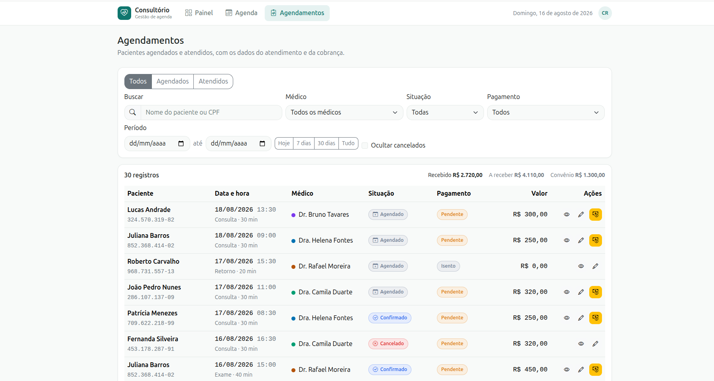

# Consultório — Gestão de Agenda


[](https://webapp-advicehealth.vercel.app/)

WebApp para a rotina de um consultório médico: a recepção agenda e cobra, o
gestor acompanha o dia.

**→ [Acessar a aplicação](https://webapp-advicehealth.vercel.app/)**

---

## Índice

- [Descrição do projeto](#descrição-do-projeto)
- [Status do projeto](#status-do-projeto)
- [Funcionalidades](#funcionalidades)
- [Demonstração](#demonstração)
- [Acesso ao projeto](#acesso-ao-projeto)
- [Tecnologias utilizadas](#tecnologias-utilizadas)
- [Estrutura do código](#estrutura-do-código)
- [Modelo de domínio](#modelo-de-domínio)
- [Decisões de arquitetura](#decisões-de-arquitetura)
- [Design e decisões de produto](#design-e-decisões-de-produto)
- [Acessibilidade](#acessibilidade)
- [Pessoas desenvolvedoras](#pessoas-desenvolvedoras)
- [Pessoas contribuidoras](#pessoas-contribuidoras)
- [Licença](#licença)

---

## Descrição do projeto

Um consultório administra o dia com três perguntas: **quem vem hoje**, **quem
já foi atendido** e **o que ainda não foi pago**. O app responde cada uma em
uma tela.

- **Painel** — indicadores do dia, agenda e lembretes do que está pendente.
- **Agenda** — grade de horários por médico, onde os agendamentos são criados,
  alterados, cancelados e transferidos.
- **Agendamentos** — consulta de agendados e atendidos, com edição do
  atendimento e da cobrança.

Não há backend: os dados ficam no `localStorage`, atrás de uma camada de
serviço que simula a latência de uma API.

---

## Status do projeto

Concluído e publicado.

---

## Funcionalidades

| | |
|---|---|
| ✅ | Indicadores do dia: agendamentos, atendidos, faturamento e próximo horário livre |
| ✅ | Agenda do dia e navegação entre datas |
| ✅ | Lembretes calculados do movimento do dia, cada um levando à tela que resolve |
| ✅ | Grade de horários por médico, com filtro por profissional |
| ✅ | Agendar clicando num horário livre, com médico e hora já preenchidos |
| ✅ | Alterar, cancelar e transferir, com histórico do que mudou |
| ✅ | Indisponibilizar períodos, inclusive de vários dias |
| ✅ | Cadastro do paciente no ato, com busca por CPF para não duplicar ficha |
| ✅ | Cobrança no momento do agendamento, com forma de pagamento |
| ✅ | Filtros por grupo, médico, situação, pagamento, período, nome ou CPF |
| ✅ | Edição da cobrança em um clique, nas linhas com pagamento pendente |
| ✅ | Validação de campos obrigatórios, notificações e confirmação em ação sem volta |
| ✅ | Responsivo e navegável por teclado |

---

## Demonstração

### Painel


### Agenda


### Agendamentos



---

## Acesso ao projeto

**Aplicação:** <https://webapp-advicehealth.vercel.app/>

```bash
git clone https://github.com/thaissyudamian/webapp_advicehealth.git
cd webapp_advicehealth
npm install
npm run dev      # http://localhost:5173
```

| Comando | |
|---|---|
| `npm run dev` | servidor de desenvolvimento |
| `npm run build` | versão de produção em `dist/` |
| `npm run preview` | serve o `dist/` localmente |
| `npm run lint` | ESLint |

Na primeira execução o app carrega uma massa de exemplo montada em torno do dia
corrente. O botão **Restaurar exemplo**, no painel, devolve tudo ao início.

---

## Tecnologias utilizadas

| | |
|---|---|
| React 18 | componentes de função e hooks |
| Vite 5 | build e servidor de desenvolvimento |
| Bootstrap 5.3 | CSS: grid, utilitários e componentes |
| Bootstrap Icons | ícones |
| React Router 7 | rotas, com estado de tela na URL |

Essas são as cinco dependências de produção. Não há biblioteca de componentes,
de tabela, de calendário, de máscara nem de datas — a agenda, a tabela, as
máscaras e a formatação foram escritas no projeto.

---

## Estrutura do código

```
src/
├── domain/         regras, formatação e consultas — sem React
├── data/           massa de exemplo
├── services/       persistência
├── store/          estado global (Context + useReducer)
├── hooks/          useForm e notificações
├── components/
│   ├── ui/         genéricos, sem regra de negócio
│   ├── layout/     barra superior e estrutura
│   └── agenda/     grade, formulário, transferência, bloqueio, cobrança
├── pages/          as três telas
└── styles/         tokens de design e ajustes do Bootstrap
```

**A regra que sustenta o reaproveitamento:** nenhum componente de
`components/ui/` importa de `store/`, `domain/` ou `data/`. Por isso `Modal`,
`FormField`, `Badge`, `StatCard`, `EmptyState`, `ConfirmDialog`, `PageHeader` e
`ToastProvider` podem ser copiados para outro projeto sem levar junto o
conceito de agendamento.

---

## Modelo de domínio

```
Medico       { id, nome, especialidade, crm, cor, valorConsulta, horarioAtendimento }
Paciente     { id, nome, cpf, nascimento, sexo, telefone, email, convenio, endereco }
Agendamento  { id, pacienteId, medicoId, data, hora, duracao, tipo, status,
               observacoes, pagamento, historico[] }
Bloqueio     { id, medicoId, data, dataFim, horaInicio, horaFim, motivo }
Aviso        { id, titulo, texto, tipo, data, lido }
```

A situação do agendamento é uma **máquina de estados**, com as transições
declaradas em um lugar só:

```
agendado → confirmado → aguardando → em atendimento → atendido
                    ↘ cancelado / faltou
```

A interface pergunta ao domínio o que pode acontecer, então um agendamento
cancelado não exibe "registrar chegada". Duas consequências:

- "agendamentos do dia" e "pacientes atendidos" são o mesmo dado em estados
  diferentes, derivados da mesma lista — não podem divergir;
- cancelado e falta **liberam a vaga** na grade, e isso está escrito uma vez.

O **pagamento tem situação própria** (`pendente`, `pago`, `isento`,
`convenio`), independente da consulta. Sem isso, "atendido mas não pago" não
seria representável, nem o convênio, que fatura depois.

---

## Decisões de arquitetura

**CSS do Bootstrap, sem o JavaScript.** O CSS é usado por inteiro, com as
classes oficiais no markup. O `bootstrap.bundle.js` fica de fora porque
manipula o DOM diretamente e conflita com o React — é a origem do modal que não
fecha e do backdrop preso na tela. Quem controla abrir e fechar é o estado do
React.

**Tema em três camadas.** Tokens próprios (`--ah-*`), remapeamento das
variáveis `--bs-*` e reescrita das regras que trazem a cor primária fixa em
hexadecimal no CSS compilado. Sem a terceira camada, a interface ficaria com
botões na cor da marca e checkbox, aba ativa e anel de foco em azul.

**Datas como texto, nunca como `Date`.** `new Date('2026-08-14')` é lido como
meia-noite UTC e, no Brasil, retorna 13 de agosto às 21h — um agendamento de
hoje apareceria ontem. Datas circulam como `'AAAA-MM-DD'`.

**`Context` + `useReducer`.** Redux seria peso morto para três telas, e estado
local não sobrevive ao painel precisar dos dados que a agenda produz. O reducer
importa porque uma operação mexe em mais de uma coleção — salvar um agendamento
pode cadastrar o paciente junto.

**Persistência atrás de um serviço.** Toda leitura e escrita passa por
`clinicaService.js`, com latência simulada. Sem a espera, os estados de
carregamento nunca apareceriam em desenvolvimento e a interface só quebraria ao
ser ligada a um servidor real.

**Estado de tela na URL.** Data da agenda, data do painel e filtros da consulta
ficam em *query string*. Isso preserva o contexto ao recarregar, permite
compartilhar um link e faz o botão voltar funcionar — e é o que permite um
lembrete do painel apontar para a consulta já filtrada.

---

## Design e decisões de produto

O desenho da interface é próprio: navegação no topo, horários em fichas, formas de
pagamento como botões e indicadores sem moldura no painel.

**Busca por CPF antes do cadastro.** Coletar os dados do zero a cada
agendamento gera fichas duplicadas. O formulário começa pelo CPF: paciente
conhecido traz os dados preenchidos.

**Horários em fichas, não em lista suspensa.** A lista esconde a
disponibilidade e o conflito só aparece ao salvar. Com as fichas, o horário
ocupado fica esmaecido e não é clicável — a validação vira prevenção.

**Check-in na recepção.** O estado "aguardando" responde "quem já chegou?", que
é a pergunta mais frequente do balcão.

**A cobrança abre pronta para cobrar.** O pagamento acontece no ato, então o
formulário abre com a situação em "pago" — e em "faturar no convênio" quando o
paciente tem convênio, que é quando o consultório recebe depois.

**Cobrança também é ação própria.** Um atendimento acontece uma vez; a cobrança
dele muda depois. As linhas com pagamento pendente têm um atalho que resolve
sem abrir o formulário completo.

**Histórico no agendamento.** Transferência, cancelamento e alteração de valor
registram o que mudou e quando.

**Lembretes calculados.** Além dos avisos cadastrados, o painel deriva
pendências do movimento do dia — "5 pagamentos pendentes", "2 consultas sem
confirmação" — e cada uma leva à tela já filtrada.

**Indicador "próximo horário livre".** Responde a pergunta mais feita ao
telefone sem abrir a agenda.

**Bloqueio recusado quando há agendamentos.** Os conflitos são listados,
verificados em todos os dias do intervalo. Apagar a agenda de alguém por engano
é pior do que exigir um passo a mais.

**A consulta fala em dois grupos.** Agendados e atendidos, em vez de expor os
sete estados internos. O filtro por situação continua disponível para quem
precisa de precisão.

---

## Acessibilidade

- HTML semântico: `main`, `nav`, `table` com `thead`/`tbody`, `form` com
  `onSubmit`, `label` associado a cada campo
- atalho "pular para o conteúdo"
- foco devolvido ao elemento de origem ao fechar um modal, e levado ao primeiro
  campo inválido quando o envio falha
- campos obrigatórios com `aria-required`, além do asterisco no rótulo
- situação nunca comunicada só por cor — sempre com rótulo em texto; períodos
  indisponíveis também se distinguem por textura
- cores dos médicos verificadas para daltonismo e contraste conforme WCAG AA

---

## Pessoas desenvolvedoras

**Thaíssy Damian** — [GitHub](https://github.com/thaissyudamian) ·
[LinkedIn](https://www.linkedin.com/in/thaissyudamian/)

---

## Pessoas contribuidoras

Projeto individual. Contribuições são bem-vindas: abra uma *issue* descrevendo
a proposta antes de enviar um *pull request*.

---

## Licença

Distribuído sob a licença MIT. Ver [`LICENSE`](LICENSE).
